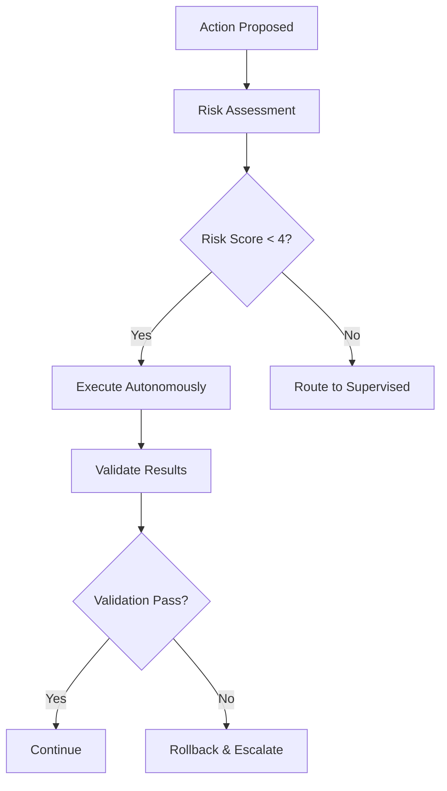
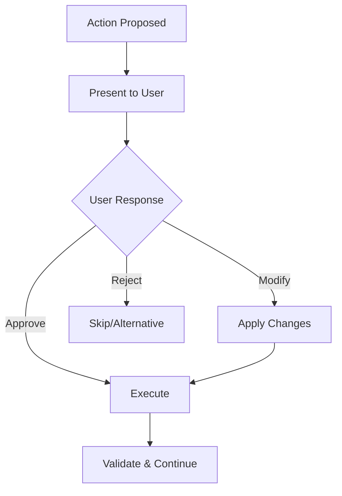

# Hybrid Execution Mode

## Overview
Hybrid mode intelligently combines autonomous and supervised execution based on task characteristics, risk assessment, and user preferences. This mode optimizes for both efficiency and control by automatically determining when to seek approval and when to proceed independently.

## Decision Engine

### Automatic Classification
```yaml
execution_rules:
  autonomous_triggers:
    - risk_level: "low"
    - operation_type: ["read", "analyze", "format", "test"]
    - file_types: [".md", ".txt", ".json", ".yaml"]
    - path_patterns: ["docs/", "tests/", "examples/"]
    - reversible: true
    - no_external_calls: true
    
  supervised_triggers:
    - risk_level: ["medium", "high"]
    - operation_type: ["delete", "deploy", "configure"]
    - file_types: [".env", ".config", "Dockerfile"]
    - path_patterns: ["src/core/", "config/", "scripts/"]
    - breaking_changes: true
    - external_integrations: true
    
  escalation_triggers:
    - security_implications: true
    - data_modification: true
    - infrastructure_changes: true
    - compliance_requirements: true
    - user_defined_critical_paths: true
```

### Risk Assessment Matrix
```yaml
risk_factors:
  file_criticality:
    core_system: 10
    configuration: 8
    user_interface: 4
    documentation: 1
    tests: 2
    
  operation_impact:
    create: 2
    read: 0
    update: 4
    delete: 9
    execute: 7
    
  reversibility:
    fully_reversible: -3
    partially_reversible: 0
    irreversible: +5
    
  external_dependencies:
    none: 0
    read_only: 1
    write_operations: 4
    destructive_operations: 8

# Total risk score determines execution mode:
# 0-3: Autonomous
# 4-7: Supervised
# 8+: Escalate to user
```

## Adaptive Behavior

### Learning from User Patterns
```yaml
pattern_learning:
  approval_history:
    track_user_decisions: true
    learn_preferences: true
    adapt_thresholds: true
    
  modification_patterns:
    common_changes: ["code_style", "naming_conventions", "error_handling"]
    auto_apply_learned: true
    confidence_threshold: 0.8
    
  rejection_analysis:
    frequent_rejections: ["database_changes", "api_modifications"]
    increase_supervision: true
    suggest_alternatives: true
```

### Dynamic Threshold Adjustment
```yaml
threshold_adaptation:
  user_expertise_level:
    beginner: "increase_supervision"
    intermediate: "balanced_approach" 
    expert: "prefer_autonomous"
    
  project_phase:
    exploration: "high_supervision"
    development: "balanced"
    maintenance: "high_autonomous"
    
  time_constraints:
    urgent: "prefer_autonomous_with_validation"
    normal: "balanced"
    exploratory: "prefer_supervised"
```

## Execution Workflows

### Autonomous Track


### Supervised Track


### Smart Batching
```yaml
batching_logic:
  autonomous_batches:
    similar_operations: true
    same_risk_level: true
    related_files: true
    max_batch_size: 10
    
  supervised_batches:
    group_related_changes: true
    provide_batch_preview: true
    allow_partial_approval: true
    max_batch_size: 5
    
  mixed_batches:
    separate_by_mode: true
    execute_autonomous_first: true
    present_supervised_together: true
```

## Configuration Options

```yaml
hybrid_settings:
  decision_engine:
    risk_tolerance: "medium"  # low, medium, high
    learning_enabled: true
    adaptation_speed: "gradual"  # slow, gradual, fast
    confidence_threshold: 0.7
    
  autonomous_preferences:
    auto_format: true
    auto_test: true
    auto_backup: true
    auto_validate: true
    
  supervision_preferences:
    show_reasoning: true
    offer_alternatives: true
    provide_impact_analysis: true
    allow_modifications: true
    
  escalation_settings:
    immediate_notification: true
    include_context: true
    suggest_consultation: true
    provide_research: true
    
  performance_tuning:
    parallel_execution: true
    cache_decisions: true
    optimize_batches: true
    predict_next_actions: true
```

## Smart Features

### Context-Aware Decisions
```yaml
contextual_factors:
  git_branch:
    main: "increase_supervision"
    feature: "allow_autonomous"
    hotfix: "require_approval"
    
  time_of_day:
    business_hours: "normal_operation"
    after_hours: "reduce_external_calls"
    weekend: "conservative_approach"
    
  recent_failures:
    count_threshold: 3
    time_window: "1_hour"
    action: "increase_supervision"
    
  test_status:
    all_passing: "allow_autonomous"
    some_failing: "require_supervision"
    no_tests: "require_explicit_approval"
```

### Predictive Execution
```yaml
prediction_features:
  next_action_prediction:
    enabled: true
    confidence_threshold: 0.8
    pre_validation: true
    
  batch_optimization:
    group_related_actions: true
    parallel_safe_operations: true
    defer_dependent_actions: true
    
  resource_anticipation:
    pre_load_dependencies: true
    cache_likely_files: true
    prepare_rollback_points: true
```

### User Assistance

#### Decision Explanations
```
┌─ Hybrid Mode Decision ──────────────────────────────────────────────┐
│ Action: Update user authentication logic                            │
│ Decision: SUPERVISED (Risk Score: 6/10)                            │
│                                                                     │
│ Risk Factors:                                                       │
│ ✓ Security implications (+3)                                       │
│ ✓ Core system file (+2)                                           │
│ ✓ External API integration (+2)                                    │
│ ✓ Non-reversible operation (+1)                                    │
│ ✗ Partial test coverage (-2)                                       │
│                                                                     │
│ Why supervised?                                                     │
│ This change affects user authentication, a critical security       │
│ component. Previous similar changes required 2 modifications       │
│ before approval. Suggesting supervised mode for safety.            │
│                                                                     │
│ Alternative: Run in autonomous mode with enhanced validation?       │
│ [Y/N]: _                                                           │
└─────────────────────────────────────────────────────────────────────┘
```

#### Learning Feedback
```
┌─ Learning Opportunity ──────────────────────────────────────────────┐
│ I noticed you consistently approve formatting changes without       │
│ modification. Should I:                                             │
│                                                                     │
│ [1] Run formatting changes autonomously in future                   │
│ [2] Continue requesting approval for formatting                     │
│ [3] Group formatting with other autonomous operations               │
│ [4] Ask again after 10 more formatting approvals                   │
│                                                                     │
│ Your preference: _                                                  │
│                                                                     │
│ Note: You can change this setting anytime with:                    │
│ claude --hybrid-config --autonomous-formatting                     │
└─────────────────────────────────────────────────────────────────────┘
```

## Advanced Scenarios

### Multi-phase Tasks
```yaml
phase_management:
  planning_phase:
    mode: "supervised"
    require_approval: true
    show_full_plan: true
    
  implementation_phase:
    mode: "hybrid"
    adapt_by_complexity: true
    batch_similar_operations: true
    
  testing_phase:
    mode: "autonomous"
    auto_run_tests: true
    escalate_on_failure: true
    
  deployment_phase:
    mode: "supervised"
    require_explicit_confirmation: true
    show_deployment_plan: true
```

### Emergency Procedures
```yaml
emergency_handling:
  high_urgency_tasks:
    prefer_autonomous: true
    reduce_validation_time: true
    allow_risk_override: true
    notify_immediately: true
    
  system_recovery:
    escalate_immediately: true
    suggest_safe_actions: true
    provide_rollback_options: true
    coordinate_with_team: true
    
  security_incidents:
    force_supervised_mode: true
    require_dual_approval: true
    log_all_actions: true
    notify_security_team: true
```

### Collaboration Features
```yaml
team_coordination:
  shared_learning:
    sync_preferences: true
    share_decision_patterns: true
    collective_risk_assessment: true
    
  approval_delegation:
    backup_approvers: ["senior_dev", "team_lead"]
    escalation_chain: true
    time_based_delegation: true
    
  knowledge_sharing:
    document_decisions: true
    share_best_practices: true
    maintain_team_standards: true
```

## Monitoring and Analytics

### Decision Metrics
```yaml
tracking_metrics:
  decision_accuracy:
    autonomous_success_rate: true
    supervision_effectiveness: true
    user_satisfaction_score: true
    
  efficiency_measures:
    time_saved_autonomous: true
    supervision_overhead: true
    overall_completion_time: true
    
  learning_progress:
    adaptation_effectiveness: true
    prediction_accuracy: true
    user_preference_alignment: true
```

### Performance Dashboard
```
Hybrid Mode Performance Summary (Last 30 Days)
═══════════════════════════════════════════════

Decision Distribution:
  Autonomous: ████████████████████████████░░ 85% (142 actions)
  Supervised: ████████░░░░░░░░░░░░░░░░░░░░░░ 12% (20 actions)
  Escalated:  ██░░░░░░░░░░░░░░░░░░░░░░░░░░░░ 3% (5 actions)

Success Rates:
  Autonomous: 94% (133/142) ⬆ +2%
  Supervised: 100% (20/20) ➡ ±0%
  Overall: 95% (153/167) ⬆ +1%

Learning Progress:
  Risk Assessment Accuracy: 88% ⬆ +5%
  User Preference Alignment: 92% ⬆ +3%
  Prediction Accuracy: 76% ⬆ +8%

Efficiency Gains:
  Time Saved: 4.2 hours ⬆ +15%
  User Interruptions: 20 ⬇ -30%
  Average Task Completion: 12 min ⬇ -25%
```

## Best Practices

### Optimization Strategies
1. **Regular Calibration**: Review and adjust risk thresholds monthly
2. **Feedback Integration**: Actively provide feedback to improve learning
3. **Pattern Recognition**: Help Claude understand your specific workflow patterns
4. **Context Sharing**: Provide relevant context for better decision-making
5. **Progressive Trust**: Gradually increase autonomous permissions as confidence builds

### Common Configurations
```yaml
# Conservative setup (prefer supervision)
conservative_hybrid:
  risk_tolerance: "low"
  supervision_threshold: 3
  escalation_threshold: 6
  learning_speed: "slow"

# Balanced setup (recommended default)  
balanced_hybrid:
  risk_tolerance: "medium"
  supervision_threshold: 4
  escalation_threshold: 8
  learning_speed: "gradual"

# Aggressive setup (prefer autonomous)
aggressive_hybrid:
  risk_tolerance: "high" 
  supervision_threshold: 6
  escalation_threshold: 9
  learning_speed: "fast"
```

## Troubleshooting

### Decision Override
```bash
# Force autonomous mode for current action
claude --force-autonomous --reason "urgent_fix"

# Force supervised mode for current action  
claude --force-supervised --reason "security_critical"

# Reset learning and start fresh
claude --reset-hybrid-learning --confirm
```

### Debug Mode
```bash
# Show decision reasoning for all actions
claude --hybrid-debug --verbose

# Export decision history for analysis
claude --export-decisions --format csv --timeframe 30d
```

## Version History
- **v1.0.0**: Initial hybrid mode configuration
- **Last Updated**: 2024-07-19
- **Next Review**: 2024-08-19