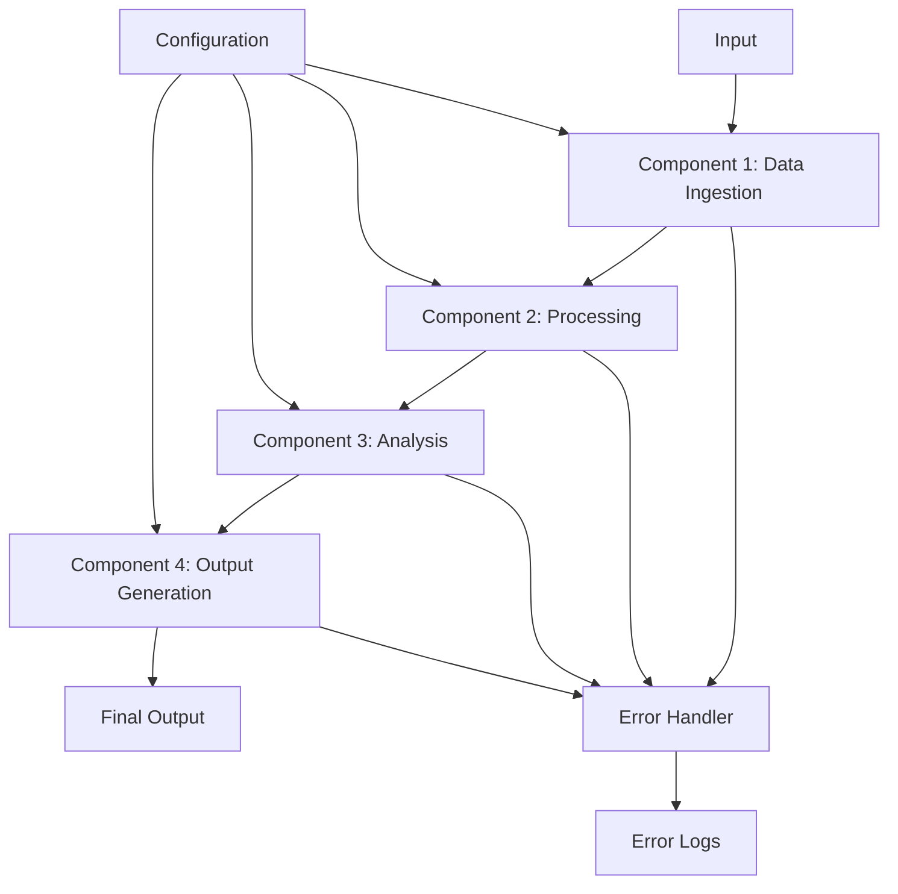
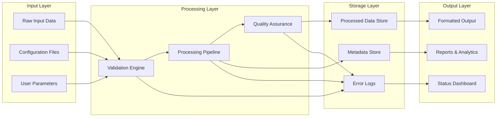
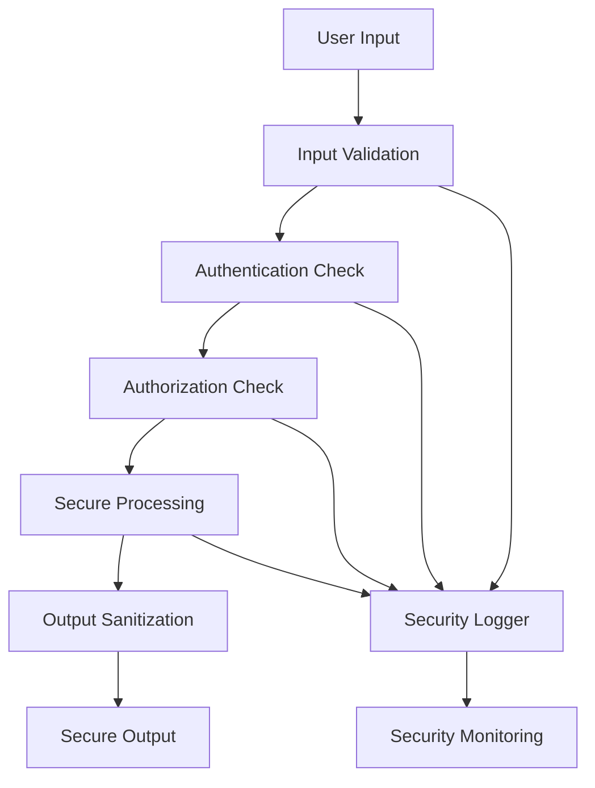

# Technical Design Document

**Project**: [PROJECT_NAME]  
**Version**: 1.0  
**Date**: [DATE]  
**Status**: Draft | In Review | Approved | Implemented  
**Related**: [requirements.md](./requirements.md)

## 📋 Design Overview

### Architecture Summary
This document translates the requirements from [requirements.md](./requirements.md) into a detailed technical architecture for [PROJECT_NAME]. The system follows a [COMPONENT_COUNT]-component pipeline architecture implementing the SLC (Simple, Lovable, Complete) methodology.

### Design Principles
- **Simple**: Minimize complexity while meeting requirements
- **Lovable**: Optimize for developer and user experience
- **Complete**: Include all necessary functionality for production use

## 🏗️ System Architecture

### High-Level Architecture


### Component Pipeline Design
The system processes data through a sequential pipeline where each component:
1. Receives input from the previous component (or external source)
2. Transforms/processes the data according to its specific function
3. Validates output quality before passing to next component
4. Handles errors gracefully with logging and recovery

## 🧩 Component Specifications

### Component 1: [Component Name]
**Purpose**: [Brief description of component function]  
**Input**: [Data format and structure]  
**Output**: [Data format and structure]

#### Interface Design
```typescript
interface Component1Input {
  data: [INPUT_TYPE];
  config: ComponentConfig;
  metadata?: ProcessingMetadata;
}

interface Component1Output {
  processedData: [OUTPUT_TYPE];
  status: ProcessingStatus;
  metrics: ProcessingMetrics;
  errors?: ErrorDetails[];
}

interface ComponentConfig {
  [CUSTOMIZE: Component-specific configuration options]
}
```

#### Processing Logic
```
Input Validation:
1. Check data format and structure
2. Validate required fields
3. Check data quality thresholds

Processing:
1. [CUSTOMIZE: Step-by-step processing logic]
2. Apply business rules
3. Transform data format

Output Validation:
1. Verify output format
2. Check processing quality metrics
3. Validate against success criteria

Error Handling:
1. Log errors with context
2. Attempt recovery if possible
3. Return partial results when appropriate
```

#### Performance Specifications
- **Processing Time**: [Maximum time per operation]
- **Throughput**: [Items processed per second/minute]
- **Memory Usage**: [Maximum memory consumption]
- **Scalability**: [Horizontal/vertical scaling approach]

### Component 2: [Component Name]
**Purpose**: [Brief description]  
**Input**: Output from Component 1  
**Output**: [Data format for Component 3]

#### Interface Design
```typescript
interface Component2Input {
  // Matches Component1Output.processedData
  data: [COMPONENT1_OUTPUT_TYPE];
  config: Component2Config;
  context: ProcessingContext;
}

interface Component2Output {
  enhancedData: [COMPONENT2_OUTPUT_TYPE];
  qualityScore: number;
  processingTime: number;
  warnings?: string[];
}
```

*[CUSTOMIZE: Continue for all components in your pipeline]*

## 💾 Data Architecture

### Data Flow Diagram


### Data Models

#### Core Data Structures
```typescript
// Primary data entity
interface ProcessingItem {
  id: string;
  version: number;
  createdAt: Date;
  updatedAt: Date;
  status: ProcessingStatus;
  data: any; // Component-specific data structure
  metadata: ProcessingMetadata;
}

// Processing metadata
interface ProcessingMetadata {
  sourceComponent: string;
  processingStartTime: Date;
  processingEndTime?: Date;
  qualityMetrics: QualityMetrics;
  errorCount: number;
  warningCount: number;
}

// Quality assessment
interface QualityMetrics {
  accuracy: number;        // 0-1 scale
  completeness: number;    // 0-1 scale
  consistency: number;     // 0-1 scale
  relevance: number;       // 0-1 scale
  overall: number;         // Calculated overall score
}
```

#### Database Schema (if applicable)
```sql
-- [CUSTOMIZE: Add database schema if using persistent storage]
CREATE TABLE processing_items (
    id UUID PRIMARY KEY,
    version INTEGER NOT NULL,
    status VARCHAR(50) NOT NULL,
    data JSONB NOT NULL,
    metadata JSONB NOT NULL,
    created_at TIMESTAMP WITH TIME ZONE DEFAULT NOW(),
    updated_at TIMESTAMP WITH TIME ZONE DEFAULT NOW()
);

CREATE INDEX idx_processing_items_status ON processing_items(status);
CREATE INDEX idx_processing_items_created ON processing_items(created_at);
```

## 🔌 API Design

### Component Interfaces

#### RESTful API Endpoints (if applicable)
```yaml
# [CUSTOMIZE: Add if building web API]
openapi: 3.0.0
info:
  title: [PROJECT_NAME] API
  version: 1.0.0
paths:
  /api/v1/process:
    post:
      summary: Submit data for processing
      requestBody:
        content:
          application/json:
            schema:
              $ref: '#/components/schemas/ProcessingRequest'
      responses:
        200:
          description: Processing initiated successfully
          content:
            application/json:
              schema:
                $ref: '#/components/schemas/ProcessingResponse'
```

#### Internal Component APIs
```typescript
// Standardized component interface
interface Component {
  name: string;
  version: string;
  
  // Main processing method
  process(input: ComponentInput): Promise<ComponentOutput>;
  
  // Health check
  healthCheck(): Promise<HealthStatus>;
  
  // Configuration validation
  validateConfig(config: ComponentConfig): ValidationResult;
  
  // Cleanup and shutdown
  cleanup(): Promise<void>;
}

// Error handling interface
interface ErrorHandler {
  handleError(error: ProcessingError, context: ErrorContext): ErrorResponse;
  isRetryable(error: ProcessingError): boolean;
  getRetryStrategy(error: ProcessingError): RetryStrategy;
}
```

## 🏛️ Infrastructure Design

### Deployment Architecture
```
[CUSTOMIZE: Choose appropriate deployment model]

Option 1: Single-Machine Deployment
┌─────────────────────────────────┐
│         Application Host         │
├─────────────────────────────────┤
│  Component 1  │  Component 2    │
│  Component 3  │  Component 4    │
├─────────────────────────────────┤
│       Configuration Store       │
│         Log Storage            │
└─────────────────────────────────┘

Option 2: Microservices Deployment
┌───────────┐  ┌───────────┐  ┌───────────┐
│Component 1│  │Component 2│  │Component 3│
│ Service   │→ │ Service   │→ │ Service   │
└───────────┘  └───────────┘  └───────────┘
      │              │              │
      └──────────────┼──────────────┘
                     │
           ┌─────────────────┐
           │ Message Queue/  │
           │ Event Bus       │
           └─────────────────┘
```

### Technology Stack
```yaml
# [CUSTOMIZE: Specify your technology choices]
Runtime:
  language: [Python/JavaScript/Go/etc.]
  version: [specific version]
  runtime: [Node.js/Python interpreter/etc.]

Dependencies:
  core_libraries:
    - [library1]: [version] # [purpose]
    - [library2]: [version] # [purpose]
  
  development_tools:
    - [testing_framework]: [version]
    - [linting_tool]: [version]
    - [formatting_tool]: [version]

Infrastructure:
  deployment: [local/cloud/container]
  monitoring: [tool/service]
  logging: [tool/service]
  configuration: [file-based/environment/service]
```

### File System Organization
```
project-root/
├── src/
│   ├── components/
│   │   ├── component1/
│   │   │   ├── __init__.py
│   │   │   ├── processor.py
│   │   │   ├── validator.py
│   │   │   └── config.py
│   │   └── component2/
│   │       └── [similar structure]
│   ├── shared/
│   │   ├── interfaces.py
│   │   ├── error_handling.py
│   │   └── utils.py
│   └── pipeline/
│       ├── orchestrator.py
│       └── monitor.py
├── config/
│   ├── default.json
│   ├── development.json
│   └── production.json
├── tests/
│   ├── unit/
│   ├── integration/
│   └── reference/
└── docs/
    ├── api/
    └── deployment/
```

## 🔒 Security Design

### Security Architecture


### Security Controls
- **Input Validation**: [Specific validation rules and sanitization]
- **Authentication**: [Authentication mechanism if applicable]
- **Authorization**: [Access control if applicable]
- **Data Protection**: [Encryption and data handling]
- **Logging**: [Security event logging]
- **Monitoring**: [Security monitoring and alerting]

## 📊 Monitoring and Observability

### Metrics Collection
```typescript
interface SystemMetrics {
  // Performance metrics
  processing_time: number;
  throughput: number;
  error_rate: number;
  
  // Quality metrics
  output_quality_score: number;
  data_completeness: number;
  
  // System health
  memory_usage: number;
  cpu_usage: number;
  disk_usage: number;
}

interface BusinessMetrics {
  // [CUSTOMIZE: Business-specific metrics]
  total_items_processed: number;
  successful_completions: number;
  cost_per_item: number;
  user_satisfaction_score: number;
}
```

### Logging Strategy
```
Log Levels:
- ERROR: System errors, processing failures
- WARN: Quality issues, performance degradation
- INFO: Processing milestones, configuration changes
- DEBUG: Detailed processing information

Log Format:
{
  "timestamp": "2024-01-01T12:00:00Z",
  "level": "INFO",
  "component": "component1",
  "message": "Processing completed successfully",
  "metadata": {
    "processing_time": 1.5,
    "items_processed": 100,
    "quality_score": 0.95
  }
}
```

## 🧪 Testing Strategy

### Test Architecture
```
Testing Pyramid:

                    /\
                   /  \
                  /E2E \     <- End-to-end tests (few)
                 /______\
                /        \
               /Integration\ <- Integration tests (some)
              /__________\
             /            \
            /    Unit      \ <- Unit tests (many)
           /________________\
```

### Test Categories

#### Unit Tests
- **Component Testing**: Each component tested in isolation
- **Function Testing**: Individual functions tested for correctness
- **Edge Case Testing**: Boundary conditions and error handling
- **Performance Testing**: Component-level performance validation

#### Integration Tests
- **Pipeline Testing**: End-to-end component chain testing
- **Interface Testing**: Component interaction validation
- **Data Flow Testing**: Data transformation accuracy
- **Error Propagation Testing**: Error handling across components

#### System Tests
- **Reference Case Testing**: Full system test with known good data
- **Load Testing**: Performance under expected load
- **Stress Testing**: Behavior under extreme conditions
- **Recovery Testing**: System recovery from failures

### Test Data Management
```typescript
interface TestDataSet {
  name: string;
  description: string;
  input: any;
  expectedOutput: any;
  testType: 'unit' | 'integration' | 'system';
  category: 'happy_path' | 'edge_case' | 'error_case';
}

// Reference test case (golden standard)
const REFERENCE_TEST_CASE: TestDataSet = {
  name: "reference_case",
  description: "[CUSTOMIZE: Description of your reference test case]",
  input: {
    // [CUSTOMIZE: Your reference input data]
  },
  expectedOutput: {
    // [CUSTOMIZE: Expected output for reference case]
  },
  testType: 'system',
  category: 'happy_path'
};
```

## 🚀 Performance Design

### Performance Requirements
- **Response Time**: [Maximum acceptable response time]
- **Throughput**: [Minimum items processed per time unit]
- **Scalability**: [How system scales with increased load]
- **Resource Efficiency**: [Memory, CPU, storage optimization]

### Performance Optimization Strategies
1. **Component Optimization**: 
   - Algorithmic efficiency improvements
   - Memory usage optimization
   - I/O operation minimization

2. **Pipeline Optimization**:
   - Parallel processing where possible
   - Efficient data passing between components
   - Resource pooling and reuse

3. **System Optimization**:
   - Caching strategies
   - Database query optimization
   - Network communication efficiency

### Performance Monitoring
```typescript
interface PerformanceMetrics {
  // Timing metrics
  component_processing_times: Map<string, number>;
  total_pipeline_time: number;
  queue_wait_times: number[];
  
  // Throughput metrics
  items_per_second: number;
  peak_throughput: number;
  sustained_throughput: number;
  
  // Resource metrics
  memory_peak: number;
  memory_average: number;
  cpu_utilization: number;
  disk_io_rate: number;
}
```

## 📋 Implementation Considerations

### Development Phases
1. **Phase 1**: Core component implementation
2. **Phase 2**: Pipeline integration and testing
3. **Phase 3**: Error handling and monitoring
4. **Phase 4**: Performance optimization
5. **Phase 5**: Production deployment preparation

### Risk Mitigation
- **Technical Risks**: [Identified technical challenges and mitigation strategies]
- **Performance Risks**: [Performance bottleneck identification and solutions]
- **Integration Risks**: [Component integration challenges and solutions]
- **Data Quality Risks**: [Data quality issues and handling strategies]

### Configuration Management
```typescript
interface SystemConfiguration {
  // Component configurations
  components: {
    [componentName: string]: ComponentConfig;
  };
  
  // Pipeline configuration
  pipeline: {
    processing_mode: 'sequential' | 'parallel';
    error_handling: 'fail_fast' | 'continue_on_error';
    retry_policy: RetryPolicy;
  };
  
  // System configuration
  system: {
    log_level: 'DEBUG' | 'INFO' | 'WARN' | 'ERROR';
    monitoring_enabled: boolean;
    performance_tracking: boolean;
  };
}
```

## 📚 References and Dependencies

### Design References
- [SLC Principles](../architecture/SLC_Principles.md) - Design methodology
- [Component Library](../architecture/ComponentLibrary.md) - Reusable patterns
- [Experience Goals](../architecture/Experience_Goals.md) - User experience targets

### Technical References
- [Technology documentation links]
- [API documentation for external dependencies]
- [Architecture pattern references]
- [Performance optimization guides]

### Related Documents
- [Requirements](./requirements.md) - What the system must do
- [Tasks](./tasks.md) - How the implementation will be broken down
- [PRD](./PRD.md) - High-level project vision and goals

---

**This technical design document provides the blueprint for implementing the requirements, ensuring all components work together effectively while meeting performance, quality, and maintainability standards.**