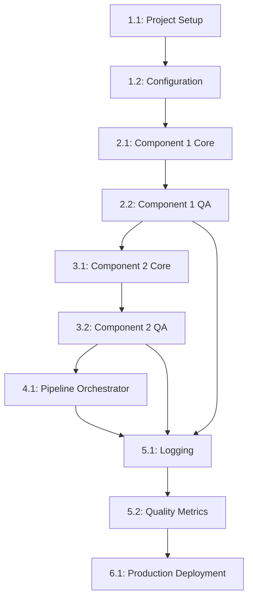

# Implementation Tasks Breakdown

**Project**: [PROJECT_NAME]  
**Version**: 1.0  
**Date**: [DATE]  
**Status**: Planning | In Progress | Complete  
**Related**: [requirements.md](./requirements.md) | [design.md](./design.md)

## 📋 Task Overview

This document breaks down the implementation of [PROJECT_NAME] into granular, sequenced tasks with clear dependencies, acceptance criteria, and traceability back to requirements and design specifications.

### Task Organization
- **Epic Level**: Major feature areas
- **Task Level**: Individual implementable units
- **Subtask Level**: Specific implementation steps
- **Dependencies**: Clear prerequisite relationships

### Task Status Legend
- 🟡 **Pending**: Not yet started
- 🔵 **In Progress**: Currently being worked on
- 🟢 **Complete**: Finished and validated
- 🔴 **Blocked**: Waiting for dependency or resolution
- ⚠️ **At Risk**: May miss deadline or has issues

## 🏗️ Epic 1: Project Foundation & Setup

### Task 1.1: Project Infrastructure Setup 🟡
**Priority**: Critical  
**Estimated Effort**: 4 hours  
**Dependencies**: None  
**Assigned To**: [TEAM_MEMBER]

#### Description
Set up the basic project structure, development environment, and essential tooling for the [PROJECT_NAME] implementation.

#### Acceptance Criteria
- [ ] Project directory structure created according to design specification
- [ ] Development environment configured (Python/Node.js/Go + dependencies)
- [ ] Version control initialized with initial commit
- [ ] CI/CD pipeline basic setup (if applicable)
- [ ] Development tooling configured (linting, formatting, testing)

#### Subtasks
- [ ] **1.1.1**: Create directory structure (`src/`, `tests/`, `config/`, `docs/`)
- [ ] **1.1.2**: Initialize package management (`requirements.txt`/`package.json`/`go.mod`)
- [ ] **1.1.3**: Configure development tools (linting, formatting)
- [ ] **1.1.4**: Set up testing framework and initial test structure
- [ ] **1.1.5**: Create initial documentation structure

#### Testing Considerations
- [ ] Verify project builds successfully
- [ ] Confirm all development tools work correctly
- [ ] Test basic CI/CD pipeline (if implemented)

#### Mobile/Accessibility Considerations
- [ ] N/A for infrastructure setup

#### Definition of Done
- [ ] All subtasks completed
- [ ] Project builds without errors
- [ ] All development tools functional
- [ ] Initial commit pushed to repository
- [ ] Team can successfully set up development environment

---

### Task 1.2: Configuration System Implementation 🟡
**Priority**: High  
**Estimated Effort**: 6 hours  
**Dependencies**: Task 1.1 (Project Infrastructure)  
**Assigned To**: [TEAM_MEMBER]

#### Description
Implement the configuration management system that will be used across all components for settings, parameters, and environment-specific values.

#### Acceptance Criteria
- [ ] Configuration loader implemented with environment override support
- [ ] Default configuration files created for all components
- [ ] Configuration validation implemented
- [ ] Environment-specific configuration support (dev/test/prod)
- [ ] Configuration documentation created

#### Subtasks
- [ ] **1.2.1**: Design configuration schema based on technical design
- [ ] **1.2.2**: Implement configuration loader class/module
- [ ] **1.2.3**: Create default configuration files
- [ ] **1.2.4**: Add configuration validation logic
- [ ] **1.2.5**: Implement environment-specific overrides
- [ ] **1.2.6**: Add configuration error handling and logging

#### Testing Considerations
- [ ] Unit tests for configuration loader
- [ ] Test configuration validation with invalid inputs
- [ ] Test environment override functionality
- [ ] Integration test with sample component

#### Mobile/Accessibility Considerations
- [ ] N/A for configuration system

#### Definition of Done
- [ ] Configuration system fully implemented
- [ ] All tests passing
- [ ] Documentation updated
- [ ] Configuration files validated
- [ ] Integration with at least one component verified

---

## 🔧 Epic 2: Component 1 - [Component Name] Implementation

### Task 2.1: Component 1 Core Implementation 🟡
**Priority**: Critical  
**Estimated Effort**: 12 hours  
**Dependencies**: Task 1.2 (Configuration System)  
**Assigned To**: [TEAM_MEMBER]

#### Description
Implement the core functionality for Component 1 as specified in the technical design, including input validation, processing logic, and output generation.

#### Acceptance Criteria
- [ ] Component interface implemented according to design specification
- [ ] Input validation implemented with comprehensive error handling
- [ ] Core processing logic implemented and optimized
- [ ] Output generation and formatting implemented
- [ ] Performance requirements met (processing time < [X] seconds)
- [ ] Error handling and logging implemented

#### Subtasks
- [ ] **2.1.1**: Implement component interface and base class
- [ ] **2.1.2**: Create input validation module
  - [ ] Data format validation
  - [ ] Required field validation
  - [ ] Data quality threshold checking
- [ ] **2.1.3**: Implement core processing logic
  - [ ] [CUSTOMIZE: Specific processing steps]
  - [ ] Business rule application
  - [ ] Data transformation
- [ ] **2.1.4**: Implement output validation and formatting
- [ ] **2.1.5**: Add comprehensive error handling
- [ ] **2.1.6**: Implement logging and metrics collection
- [ ] **2.1.7**: Performance optimization and profiling

#### Testing Considerations
- [ ] **Unit Tests**:
  - [ ] Input validation with valid/invalid data
  - [ ] Core processing logic with various inputs
  - [ ] Output generation and formatting
  - [ ] Error handling for all error conditions
- [ ] **Integration Tests**:
  - [ ] End-to-end processing with reference test case
  - [ ] Configuration integration testing
  - [ ] Performance testing under normal load
- [ ] **Edge Case Tests**:
  - [ ] Empty input handling
  - [ ] Malformed input handling
  - [ ] Resource exhaustion scenarios

#### Mobile/Accessibility Considerations
- [ ] N/A for backend component (if applicable)
- [ ] Output format accessible for downstream processing

#### Definition of Done
- [ ] All subtasks completed and tested
- [ ] Reference test case processes successfully
- [ ] Performance requirements verified
- [ ] Code coverage >80% for component
- [ ] Error handling tested for all scenarios
- [ ] Documentation updated with component API

---

### Task 2.2: Component 1 Quality Assurance & Integration 🟡
**Priority**: High  
**Estimated Effort**: 8 hours  
**Dependencies**: Task 2.1 (Component 1 Core Implementation)  
**Assigned To**: [TEAM_MEMBER]

#### Description
Implement quality assurance measures, comprehensive testing, and prepare Component 1 for integration with the pipeline.

#### Acceptance Criteria
- [ ] Comprehensive test suite implemented with >90% coverage
- [ ] Quality metrics collection implemented
- [ ] Integration interface tested and documented
- [ ] Performance benchmarking completed
- [ ] Component ready for pipeline integration

#### Subtasks
- [ ] **2.2.1**: Implement quality metrics collection
  - [ ] Processing accuracy measurement
  - [ ] Data completeness assessment
  - [ ] Performance metrics tracking
- [ ] **2.2.2**: Create comprehensive test data sets
  - [ ] Happy path test cases
  - [ ] Edge case test data
  - [ ] Error condition test scenarios
- [ ] **2.2.3**: Implement stress testing
  - [ ] High volume data processing
  - [ ] Memory usage testing
  - [ ] Concurrent processing testing
- [ ] **2.2.4**: Create integration test framework
- [ ] **2.2.5**: Document component API and usage
- [ ] **2.2.6**: Performance benchmarking and optimization

#### Testing Considerations
- [ ] **Load Testing**: Component handles expected data volumes
- [ ] **Stress Testing**: Component gracefully handles resource limits
- [ ] **Integration Testing**: Component integrates properly with test harness
- [ ] **Quality Testing**: Output quality meets specification

#### Mobile/Accessibility Considerations
- [ ] Output format compatible with accessibility tools (if user-facing)

#### Definition of Done
- [ ] Test coverage >90%
- [ ] All quality metrics implemented and validated
- [ ] Performance benchmarks documented
- [ ] Integration tests passing
- [ ] Component documentation complete

---

## 🔄 Epic 3: Component 2 - [Component Name] Implementation

*[CUSTOMIZE: Follow the same pattern as Epic 2 for each component]*

### Task 3.1: Component 2 Core Implementation 🟡
**Priority**: Critical  
**Estimated Effort**: 10 hours  
**Dependencies**: Task 2.2 (Component 1 QA & Integration)  
**Assigned To**: [TEAM_MEMBER]

#### Description
Implement Component 2 functionality that processes output from Component 1 and prepares it for Component 3.

#### Acceptance Criteria
- [ ] Component 2 interface implemented
- [ ] Integration with Component 1 output verified
- [ ] Processing logic implemented according to design
- [ ] Output format compatible with Component 3
- [ ] Performance and quality requirements met

*[Continue with detailed subtasks, testing, and definition of done...]*

---

## 🔗 Epic 4: Pipeline Integration & Orchestration

### Task 4.1: Pipeline Orchestrator Implementation 🟡
**Priority**: Critical  
**Estimated Effort**: 10 hours  
**Dependencies**: All component implementations complete  
**Assigned To**: [TEAM_MEMBER]

#### Description
Implement the pipeline orchestrator that coordinates execution of all components in sequence, handles data flow, and manages error conditions.

#### Acceptance Criteria
- [ ] Pipeline orchestrator implemented with configurable component sequence
- [ ] Data flow management between components
- [ ] Error handling and recovery strategies implemented
- [ ] Pipeline monitoring and logging implemented
- [ ] Reference test case processes end-to-end successfully

#### Subtasks
- [ ] **4.1.1**: Design pipeline orchestrator architecture
- [ ] **4.1.2**: Implement component sequencing logic
- [ ] **4.1.3**: Create data flow management system
- [ ] **4.1.4**: Implement error handling and recovery
  - [ ] Component failure detection
  - [ ] Partial result preservation
  - [ ] Retry logic for transient failures
- [ ] **4.1.5**: Add pipeline monitoring and metrics
- [ ] **4.1.6**: Implement pipeline configuration management
- [ ] **4.1.7**: Create pipeline status reporting

#### Testing Considerations
- [ ] **End-to-End Testing**: Full pipeline with reference test case
- [ ] **Error Testing**: Component failure scenarios and recovery
- [ ] **Performance Testing**: Pipeline performance under load
- [ ] **Configuration Testing**: Different pipeline configurations

#### Mobile/Accessibility Considerations
- [ ] Status reporting accessible through multiple interfaces
- [ ] Error messages clear and actionable

#### Definition of Done
- [ ] Pipeline processes reference test case successfully
- [ ] All error scenarios handled gracefully
- [ ] Performance meets requirements
- [ ] Monitoring and logging operational
- [ ] Pipeline configuration documented

---

## 📊 Epic 5: Monitoring, Logging & Quality Assurance

### Task 5.1: Comprehensive Logging Implementation 🟡
**Priority**: High  
**Estimated Effort**: 6 hours  
**Dependencies**: Task 4.1 (Pipeline Orchestrator)  
**Assigned To**: [TEAM_MEMBER]

#### Description
Implement comprehensive logging throughout the system for debugging, monitoring, and audit purposes.

#### Acceptance Criteria
- [ ] Structured logging implemented across all components
- [ ] Log levels properly configured (DEBUG, INFO, WARN, ERROR)
- [ ] Performance and quality metrics logged
- [ ] Log aggregation and filtering capabilities
- [ ] Log retention and rotation policies implemented

#### Subtasks
- [ ] **5.1.1**: Implement structured logging framework
- [ ] **5.1.2**: Add logging to all components and pipeline
- [ ] **5.1.3**: Configure log levels and filtering
- [ ] **5.1.4**: Implement metrics logging
- [ ] **5.1.5**: Set up log rotation and retention
- [ ] **5.1.6**: Create log analysis and reporting tools

#### Definition of Done
- [ ] Logging operational across entire system
- [ ] Log analysis tools functional
- [ ] Performance impact minimal
- [ ] Log retention policies active

---

### Task 5.2: Quality Metrics & Reporting 🟡
**Priority**: Medium  
**Estimated Effort**: 8 hours  
**Dependencies**: Task 5.1 (Logging Implementation)  
**Assigned To**: [TEAM_MEMBER]

#### Description
Implement comprehensive quality metrics collection and reporting for system performance and output quality monitoring.

#### Acceptance Criteria
- [ ] Quality metrics collection implemented for all components
- [ ] Performance metrics tracking and reporting
- [ ] Quality score calculation and thresholds
- [ ] Reporting dashboard or interface created
- [ ] Automated quality alerts implemented

#### Subtasks
- [ ] **5.2.1**: Define quality metrics schema
- [ ] **5.2.2**: Implement metrics collection across components
- [ ] **5.2.3**: Create quality score calculation algorithms
- [ ] **5.2.4**: Build reporting interface/dashboard
- [ ] **5.2.5**: Implement quality threshold alerts
- [ ] **5.2.6**: Create historical trend analysis

#### Definition of Done
- [ ] Quality metrics collected and accurate
- [ ] Reporting interface functional
- [ ] Quality alerts working
- [ ] Historical analysis available

---

## 🚀 Epic 6: Production Deployment & Documentation

### Task 6.1: Production Deployment Preparation 🟡
**Priority**: High  
**Estimated Effort**: 6 hours  
**Dependencies**: All implementation tasks complete  
**Assigned To**: [TEAM_MEMBER]

#### Description
Prepare the system for production deployment including configuration, documentation, and deployment scripts.

#### Acceptance Criteria
- [ ] Production configuration files created and validated
- [ ] Deployment documentation complete
- [ ] System requirements documented
- [ ] Installation and setup scripts created
- [ ] Production readiness checklist completed

#### Subtasks
- [ ] **6.1.1**: Create production configuration files
- [ ] **6.1.2**: Document system requirements and dependencies
- [ ] **6.1.3**: Create installation and setup scripts
- [ ] **6.1.4**: Write deployment guide and troubleshooting
- [ ] **6.1.5**: Create production readiness checklist
- [ ] **6.1.6**: Validate production configuration with reference test

#### Definition of Done
- [ ] Production deployment tested
- [ ] Documentation complete and accurate
- [ ] Setup scripts functional
- [ ] System ready for production use

---

## 📋 Task Dependencies Map

## 📊 Task Summary Dashboard

| Epic | Total Tasks | Estimated Hours | Priority | Status |
|------|-------------|----------------|----------|---------|
| Epic 1: Foundation | 2 | 10 | Critical | 🟡 Pending |
| Epic 2: Component 1 | 2 | 20 | Critical | 🟡 Pending |
| Epic 3: Component 2 | 2 | 18 | Critical | 🟡 Pending |
| Epic 4: Pipeline | 1 | 10 | Critical | 🟡 Pending |
| Epic 5: QA & Monitoring | 2 | 14 | High | 🟡 Pending |
| Epic 6: Production | 1 | 6 | High | 🟡 Pending |
| **TOTAL** | **10** | **78** | - | 🟡 Pending |

## 📅 Implementation Timeline

### Phase 1: Foundation (Week 1)
- Task 1.1: Project Infrastructure Setup
- Task 1.2: Configuration System Implementation

### Phase 2: Core Components (Weeks 2-4)
- Task 2.1: Component 1 Core Implementation
- Task 2.2: Component 1 Quality Assurance
- Task 3.1: Component 2 Core Implementation
- Task 3.2: Component 2 Quality Assurance
- *[Continue for all components]*

### Phase 3: Integration (Week 5)
- Task 4.1: Pipeline Orchestrator Implementation

### Phase 4: Quality & Production (Week 6)
- Task 5.1: Comprehensive Logging Implementation
- Task 5.2: Quality Metrics & Reporting
- Task 6.1: Production Deployment Preparation

## 🎯 Success Criteria by Epic

### Epic 1 Success Criteria
- [ ] Development environment fully functional
- [ ] All team members can build and run project
- [ ] Configuration system operational

### Epic 2-N Success Criteria (Per Component)
- [ ] Component processes reference test case successfully
- [ ] Performance requirements met
- [ ] Quality metrics above thresholds
- [ ] Integration tests passing

### Epic 4 Success Criteria (Pipeline)
- [ ] End-to-end reference test case completes successfully
- [ ] Error handling works for all failure scenarios
- [ ] Performance meets overall system requirements

### Epic 5 Success Criteria (Quality)
- [ ] Comprehensive logging operational
- [ ] Quality metrics tracking functional
- [ ] Monitoring and alerting active

### Epic 6 Success Criteria (Production)
- [ ] System deployable to production environment
- [ ] Documentation complete and accurate
- [ ] Production readiness validated

## 🔄 Iteration & Feedback Loops

### Daily Check-ins
- Review task progress and blockers
- Update task status and estimates
- Identify risks and mitigation strategies

### Weekly Reviews
- Complete epic assessment
- Reference test case validation
- Quality metrics review
- Timeline adjustment if needed

### Epic Completion Reviews
- Epic success criteria validation
- Integration testing completion
- Documentation review and update
- Lessons learned capture

## 📚 References

### Related Documents
- [Requirements](./requirements.md) - What each task must accomplish
- [Technical Design](./design.md) - How each task should be implemented
- [PRD](./PRD.md) - Overall project goals and vision

### Task Management
- [CUSTOMIZE: Link to your task tracking system]
- Task updates should be reflected in project management tools
- Dependencies must be tracked and validated before task start

---

**This task breakdown provides the detailed roadmap for implementing [PROJECT_NAME], ensuring all requirements are met through systematic, testable, and traceable development work.**